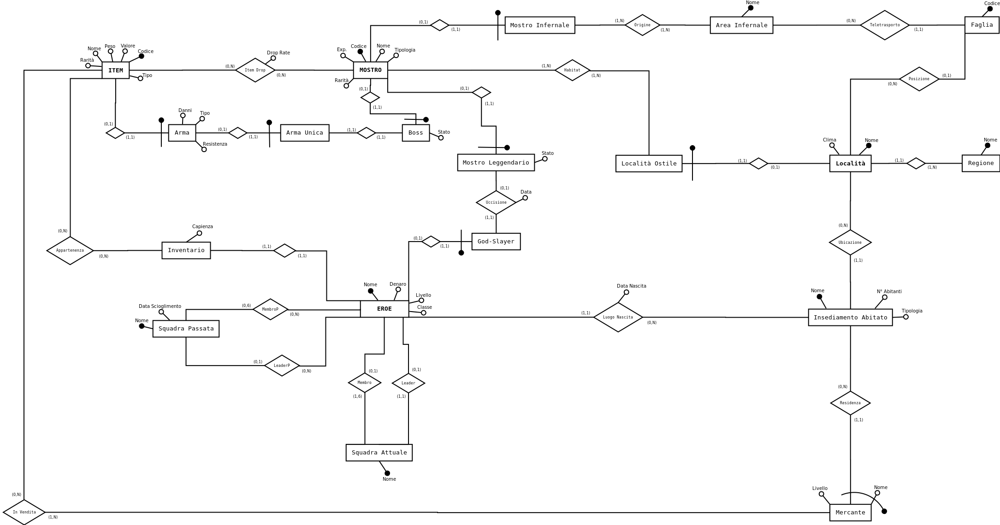

# Dynasty_Crysis - Progetto basi di dati

## Informazioni generali

* **Linguaggio:** SQL

* **DBMS:** MariaDB

* **Storage engine:** InnoDB 

Altre informazioni utili nella [Documentazione](./Docs/Relazione_Progetto-Basi_di_Dati.pdf)

## Schema Entity-Relationship di progettazione

## Schema Logico di progettazione

