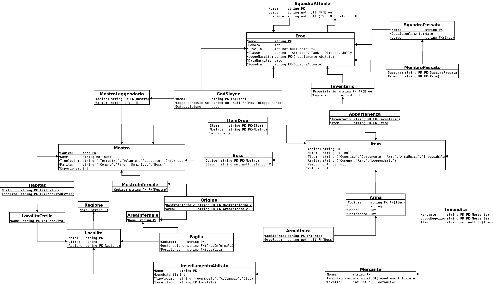

# Dynasty_Crysis - Progetto basi di dati

## Informazioni generali

* **Linguaggio:** SQL

* **DBMS:** MariaDB

* **Storage engine:** InnoDB 

Altre informazioni utili nella [Documentazione](./Docs/Relazione_Progetto-Basi_di_Dati.pdf)

## Collaboratori

| Nome | Account Github | Email |
| ------ | ------ | ------ |
| Federico Omodei | https://github.com/Fomodei94 | federico.omodei[at]gmail |
| Luca Violato | https://github.com/Rei2229 | lucaviolato1994[at]gmail | 

## Schema Entity-Relationship di progettazione

## Schema Logico di progettazione

